# Assignment2 example

Assignment 2 asks you to do the following things:

1.  get means on outcome variables for *8* groups  
2.  Using SPSS or Excel *or R*, graphically display them on a
    well-labeled barchart

The first thing that you need to do is to decide on your variables and
these fall into two groups:

1.  Outcome variables
2.  Variables defining groups.

Because Prof. Battle asked you to get the means, the outcome variables
must be appropriate for calculating a mean. That means that they should
be *numeric* also known as *interval*. However, it is sometimes okay to
treat *ordinal* variables as though they are numbers.

You need to pick 2 outcome variables that are ordinal or interval.

By groups, the assignment means people who have two different
characterstics in common.

So, for example, it could mean “women who are over 70”, which combines
gender and age to create a group. Or “Black people who live in the
south.”

*This assignment will make the most sense and be most useful if you pick
variables that you are at least somewhat interested in!*

Also if you think about comparing groups you can create your 8 groups
that will allow you to make useful comparisons.

*Make a list of your outcome variables here*

For the examples we’ll use `rss1$SUN_CLOUDY` and `rss1$SUN_NOHARM`.

*Make a list of your groups here*

*What are the variable names of the variables you will be using?*

In creating grouping, you can decide to pair up some combinations so
that they differ in just one way.

For the groups in the example we’ll use:

1.  Males over 70 (P_GENDER, P_AGEC_R)  

2.  Females over 70 (P_GENDER, P_AGEC_R)

3.  Language used with doctor is Spanish and are Hispanic (P_RACE_R,
    LAN_DOCTOR)  

4.  Language used with doctor is English and are Hispanic (P_RACE_R,
    LAN_DOCTOR)

5.  Language used with doctor is Spanish and Male (P_GENDER,
    LAN_DOCTOR)  

6.  Language used with doctor is Spanish and Female (P_GENDER,
    LAN_DOCTOR)

7.  People live in metropolitan areas and who live in the South who
    (P_REGION & PMETRO_R).  

8.  People who live in metropolitan areas and who live in the Northeast
    (P_REGION & PMETRO_R).

Notice that this means that we are *excluding* certain groups. For
example: \* people who are under 70  
\* people who are not Hispanic  
\* people who don’t use Spanish with their doctors \* people who live in
the Midwest and West and who no not live in metropolitan areas (cities).

First let’s look at the dependent variables.

``` r

data_tabulate(c(rss1$SUN_NOHARM))
```

    c(rss1$SUN_NOHARM) <categorical>
    # total N=7599 valid N=7510

    Value             |    N | Raw % | Valid % | Cumulative %
    ------------------+------+-------+---------+-------------
    Strongly disagree | 4295 | 56.52 |   57.19 |        57.19
    Somewhat disagree | 2000 | 26.32 |   26.63 |        83.82
    Somewhat agree    |  756 |  9.95 |   10.07 |        93.89
    Strongly agree    |  459 |  6.04 |    6.11 |       100.00
    <NA>              |   89 |  1.17 |    <NA> |         <NA>

``` r

data_tabulate(c(rss1$SUN_CLOUDY))
```

    c(rss1$SUN_CLOUDY) <categorical>
    # total N=7599 valid N=7489

    Value             |    N | Raw % | Valid % | Cumulative %
    ------------------+------+-------+---------+-------------
    Strongly disagree | 2955 | 38.89 |   39.46 |        39.46
    Somewhat disagree | 2823 | 37.15 |   37.70 |        77.15
    Somewhat agree    | 1254 | 16.50 |   16.74 |        93.90
    Strongly agree    |  457 |  6.01 |    6.10 |       100.00
    <NA>              |  110 |  1.45 |    <NA> |         <NA>

First, let’s do a little trick to make the two variables numeric because
if we don’t calculating the mean can’t work!

``` r

distribution_mean(rss1$SUN_NOHARM)
```

    Warning in mean.default(x, na.rm = remove_na): argument is not numeric or
    logical: returning NA

    [1] NA

``` r

distribution_mean(rss1$SUN_CLOUDY)
```

    Warning in mean.default(x, na.rm = remove_na): argument is not numeric or
    logical: returning NA

    [1] NA

``` r

distribution_mean(rss1$SUN_NOHARM, convert_to_numeric = TRUE)
```

    [1] 1.650999

``` r

distribution_mean(rss1$SUN_CLOUDY, convert_to_numeric = TRUE)
```

    [1] 1.894913

Since we are going to calculate a lot of means, it makes sense to make a
change by creating temporary numeric versions of the variables.

``` r

rss1$SUN_CLOUDY_N <- to_numeric(rss1$SUN_CLOUDY)
rss1$SUN_NOHARM_N <- to_numeric(rss1$SUN_NOHARM)
```

## Overall means

``` r

distribution_mean(rss1$SUN_NOHARM_N)
```

    [1] 1.650999

``` r

distribution_mean(rss1$SUN_CLOUDY_N)
```

    [1] 1.894913

## Groups 1 and 2

Males over 70 and Females over 70

Idea: Older women will be more aware of the health issues of sunburn
than older men.

Reason: Women are general more aware of health issues than men.

### Step 1

Subset the data to get our groups in two separate data sets.

``` r

data_filter(rss1, P_GENDER == "Male" & 
                 P_AGEC_R == "70+") -> temp1m 
data_filter(rss1, P_GENDER == "Female" & 
                 P_AGEC_R == "70+") -> temp1f 
```

### Step 2: Get the Means

``` r

distribution_mean(temp1m$SUN_CLOUDY_N)
```

    [1] 1.827141

``` r

distribution_mean(temp1f$SUN_CLOUDY_N)
```

    [1] 1.625185

Males over 70 have a higher score in terms of ageeing with the statement
that “On cloudy days you don’t need to worry about sun” than women over
70.

### Step 3 make the charts

``` r

distribution_bar(temp1f$SUN_CLOUDY,
                 title = 
                 "Cloudy days don’t need to worry about sun (females)")
```

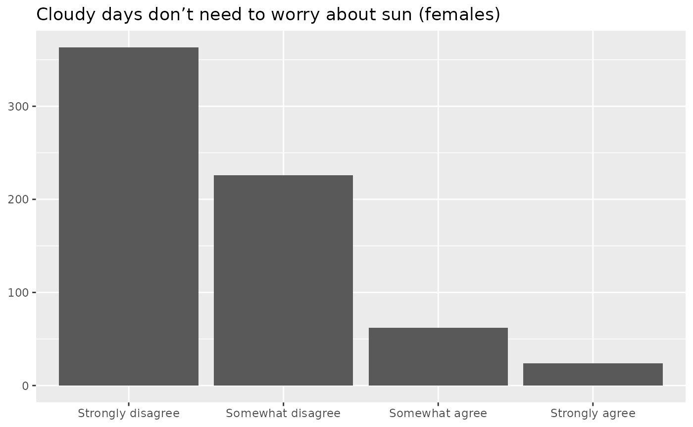

``` r

distribution_bar(temp1m$SUN_CLOUDY,
                 title = 
                 "Cloudy days don’t need to worry about sun (males)")
```

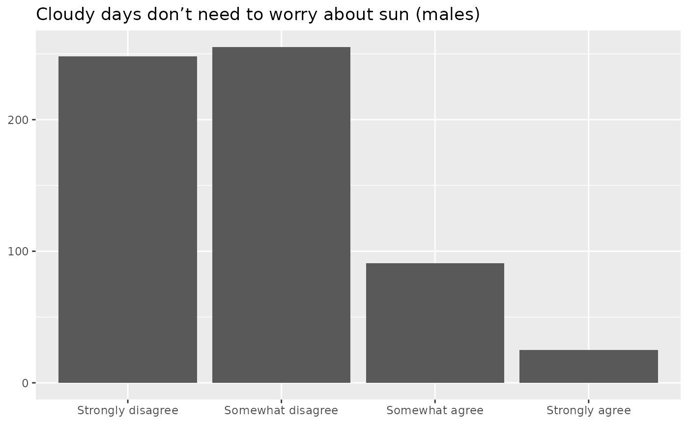

The bar charts show that few people over 70 of either gender strongly or
somewhat agree with the statement. Women were more likely to strongly
disagree than to somewhat disagree. However, men were more evenly
divided, with slightly more saying they “somewhat agree” than saying
they “strongly agree.”

### Repeat for SUN_NOHARM

We are using the same subsamples so we don’t need to subset again.

We can put all of the code in one code chunk.

``` r

distribution_mean(temp1m$SUN_NOHARM_N)
```

    [1] 1.626214

``` r

distribution_mean(temp1f$SUN_NOHARM_N)
```

    [1] 1.480176

``` r

distribution_bar(temp1f$SUN_NOHARM,
                 title = 
                 "Sunburn is not harmful in long run (females)")
```

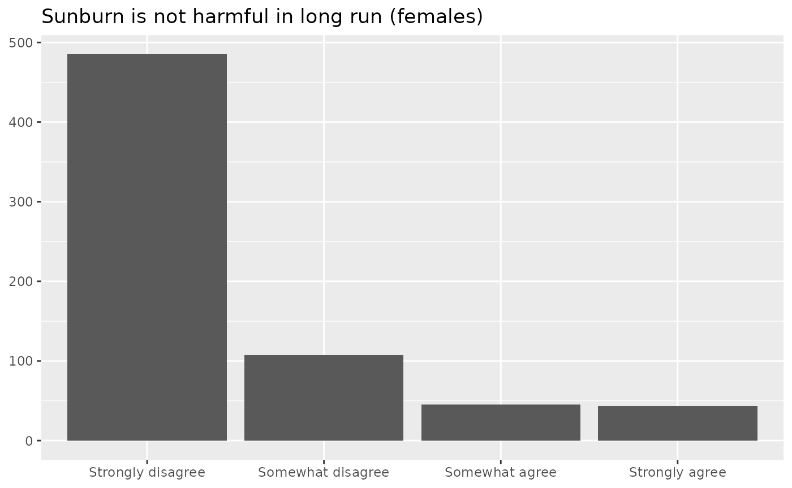

``` r

distribution_bar(temp1m$SUN_NOHARM,
                 title = 
                 "Sunburn is not harmful in long run (males)")
```

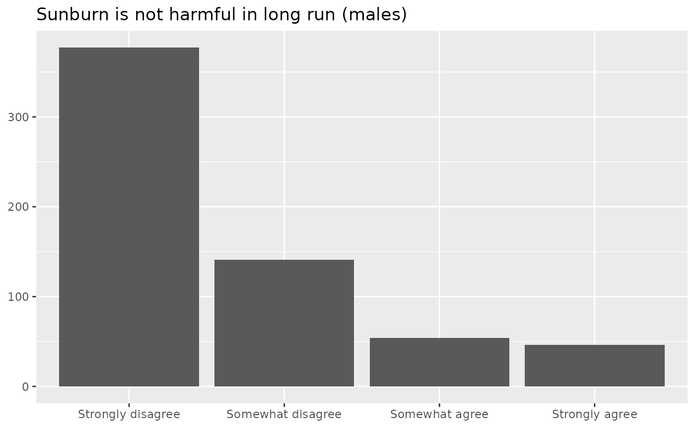

Males over 70 have higher mean disagreement with the statement that
“sunburn is not harmful in long run” than females over 70. Overall,
women over 70 are more likely to Strongly disagree with the statement
than men over 70.

### Overall conclusion

Overall, based on their responses about the harm of sunburn and the
risks of sunburnon cloudy days, most people over 70 agree that sunburn
is harmful. However, women have much stronger beliefs about these
dangers.

## Comparison 2

Hispanics who talk to their doctors in Spanish and Hispanics who talk to
their doctors in English

Idea: In the U.S. communicating with the your doctor in a language
besides English will be associated with being less concerned with
sunburn.

Reason: The doctors may be less fluent in Spanish or language barriers
might make them less likely to give information on topics like sunburn.

### Filter data

``` r

data_filter(rss1, P_RACE_R  == "Hispanic" & 
                 LAN_DOCTOR == "Spanish") -> temp2s 
data_filter(rss1, P_RACE_R  == "Hispanic" & 
                 LAN_DOCTOR == "English") -> temp2e 
```

### Get means and charts SUN_CLOUDY

``` r

distribution_mean(temp2e$SUN_CLOUDY_N)
```

    [1] 2

``` r

distribution_mean(temp2s$SUN_CLOUDY_N)
```

    [1] 2.227273

``` r

distribution_bar(temp2e$SUN_CLOUDY,
                 title = 
                 "Cloudy days don’t need to worry about sun (English)")
```

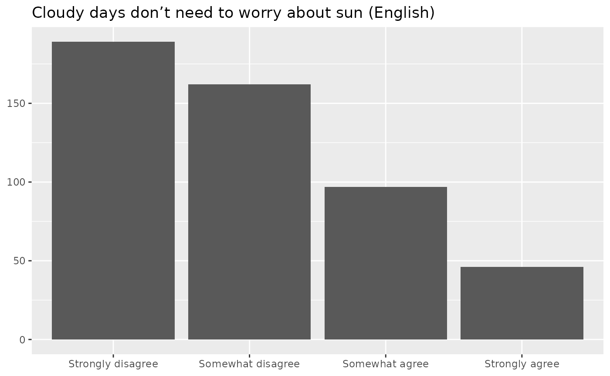

``` r

distribution_bar(temp2s$SUN_CLOUDY,
                 title = 
                 "Cloudy days don’t need to worry about sun (Spanish)")
```

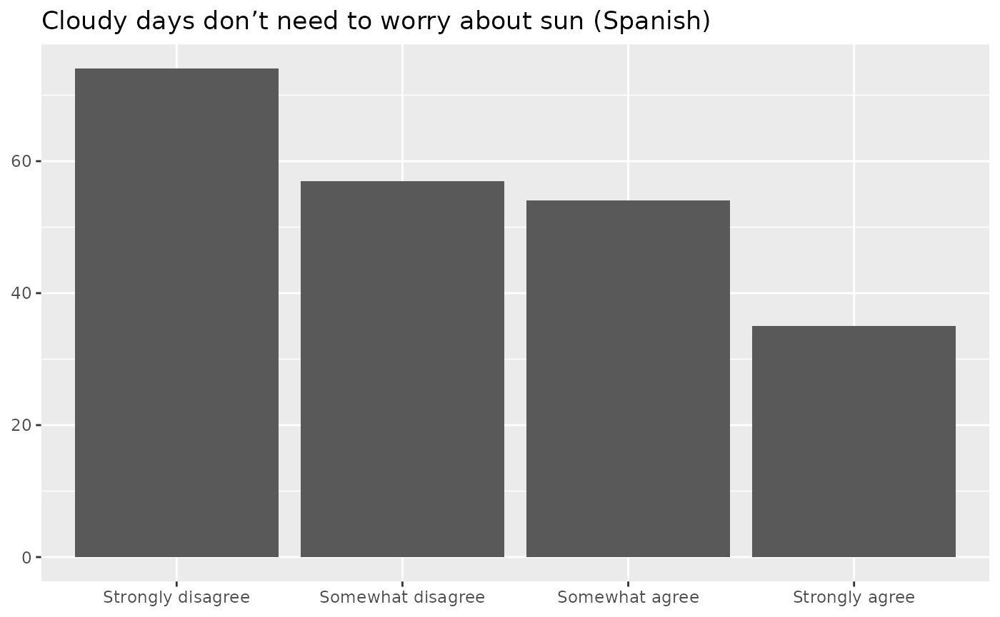

### Get means and charts SUN_NOHARM

``` r

distribution_mean(temp2e$SUN_NOHARM_N)
```

    [1] 1.678138

``` r

distribution_mean(temp2s$SUN_NOHARM_N)
```

    [1] 1.928251

``` r

distribution_bar(temp2e$SUN_NOHARM,
                 title = 
                 "Sunburn is not harmful in long run (females)")
```

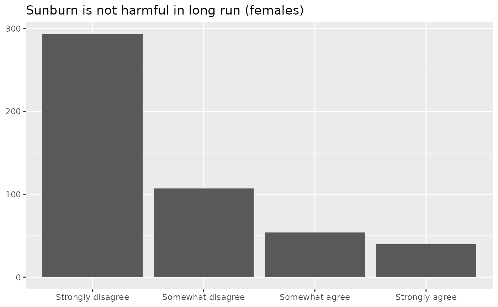

``` r

distribution_bar(temp2s$SUN_NOHARM,
                 title = 
                 "Sunburn is not harmful in long run (males)")
```

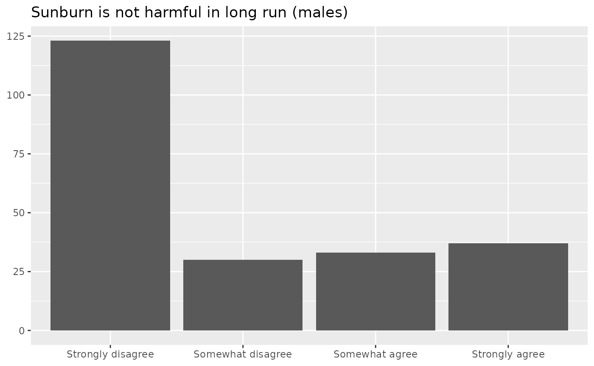

### Overall conclusion

## Comparison 3

Idea: Hispanic women will be more concerned about sunburn than Hispanic
men.

Reason: In general women have more health informaiton than men. Hispanic
people should follow the same pattern.

### Filter data

``` r

data_filter(rss1, P_RACE_R  == "Hispanic" & 
                  P_GENDER == "Male") -> temp3m 
data_filter(rss1, P_RACE_R  == "Hispanic" & 
                  P_GENDER == "Female") -> temp3f 
```

### Get means and charts SUN_CLOUDY

``` r

distribution_mean(temp3m$SUN_CLOUDY_N)
```

    [1] 2.145009

``` r

distribution_mean(temp3f$SUN_CLOUDY_N)
```

    [1] 1.914336

``` r

distribution_bar(temp3m$SUN_CLOUDY,
                 title = 
                 "Cloudy days don’t need to worry about sun (Males)")
```

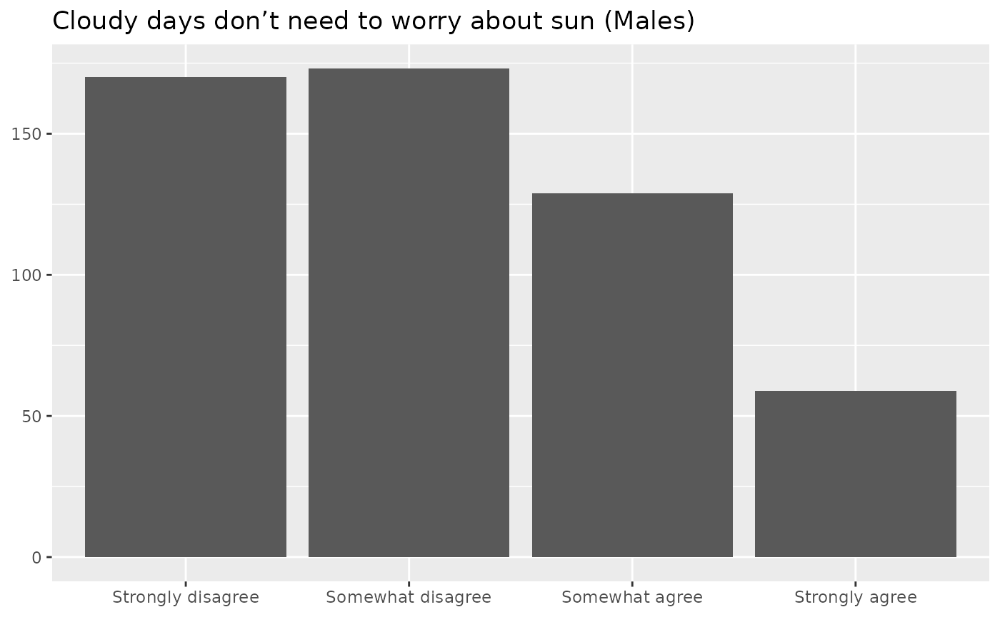

``` r

distribution_bar(temp3f$SUN_CLOUDY,
                 title = 
                 "Cloudy days don’t need to worry about sun (Females)")
```

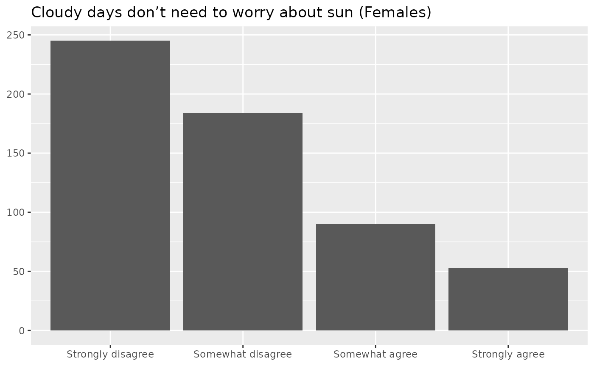

### Get means and charts SUN_NOHARM

``` r

distribution_mean(temp3f$SUN_NOHARM_N)
```

    [1] 1.702609

``` r

distribution_mean(temp3m$SUN_NOHARM_N)
```

    [1] 1.801126

``` r

distribution_bar(temp3f$SUN_NOHARM,
                 title = 
                 "Sunburn is not harmful in long run (females)")
```

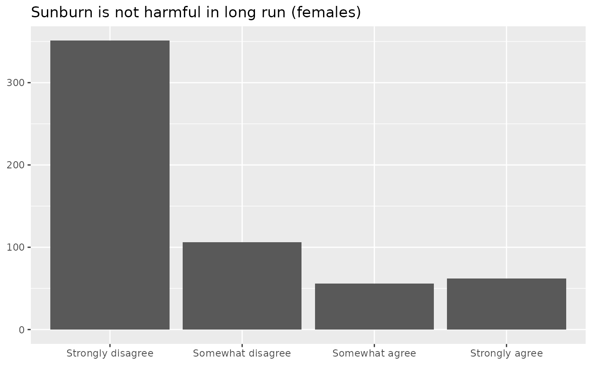

``` r

distribution_bar(temp3m$SUN_NOHARM,
                 title = 
                 "Sunburn is not harmful in long run (males)")
```

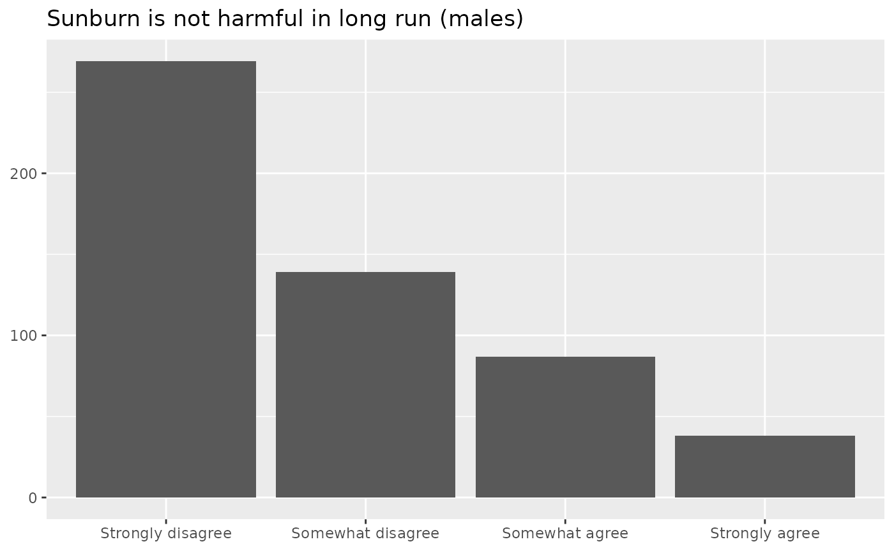 \###
Overall conclusion

## Comparison 4

(P_REGION & PMETRO_R)

Idea: People in the south who live in metropolitian areas will be more
aware of the risks of sunburn.

Reason: The further south people are, the more they are exposed to sun
because it is warmer.

### Filter data

``` r

data_filter(rss1, P_METRO_R  == "Metropolitan" & 
                 P_REGION == "Northeast") -> temp4n 
data_filter(rss1, P_METRO_R  == "Metropolitan" & 
                 P_REGION == "South") -> temp4s 
```

### Get means and charts SUN_CLOUDY

``` r

distribution_mean(temp4n$SUN_CLOUDY_N)
```

    [1] 1.931961

``` r

distribution_mean(temp4s$SUN_CLOUDY_N)
```

    [1] 1.910908

``` r

distribution_bar(temp4n$SUN_CLOUDY,
                 title = 
                 "Cloudy days don’t need to worry about sun (North)")
```

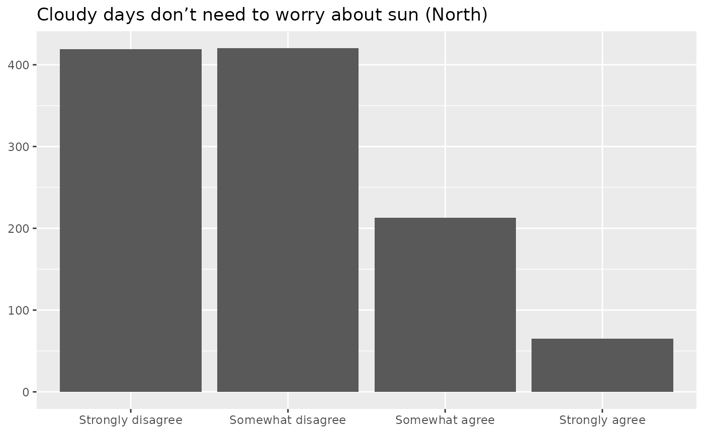

``` r

distribution_bar(temp4s$SUN_CLOUDY,
                 title = 
                 "Cloudy days don’t need to worry about sun (South)")
```

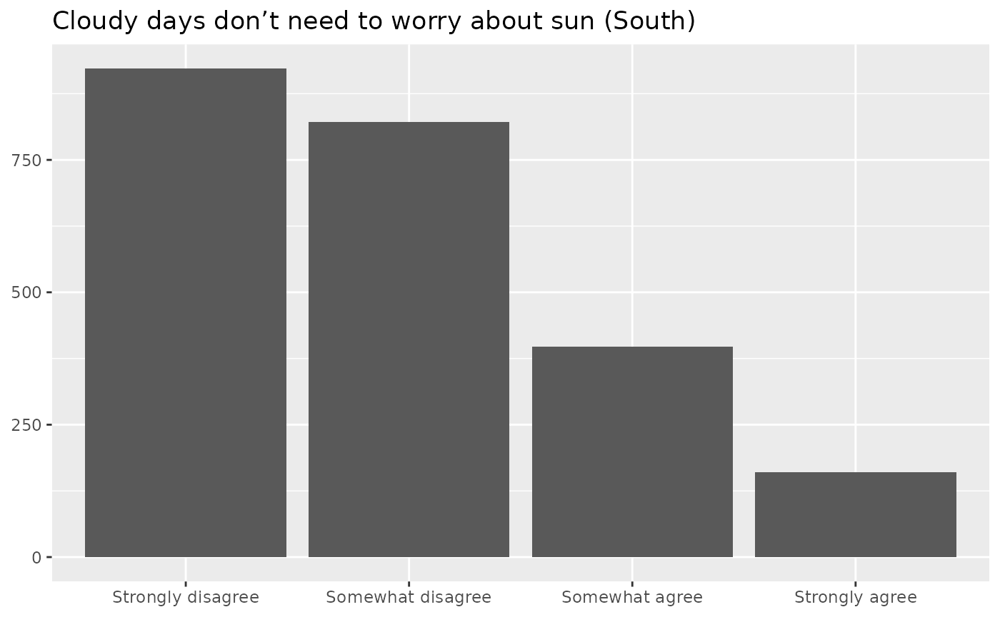

### Get means and charts SUN_NOHARM

``` r

distribution_mean(temp4n$SUN_NOHARM_N)
```

    [1] 1.621766

``` r

distribution_mean(temp4s$SUN_NOHARM_N)
```

    [1] 1.657576

``` r

distribution_bar(temp4n$SUN_NOHARM,
                 title = 
                 "Sunburn is not harmful in long run (North)")
```

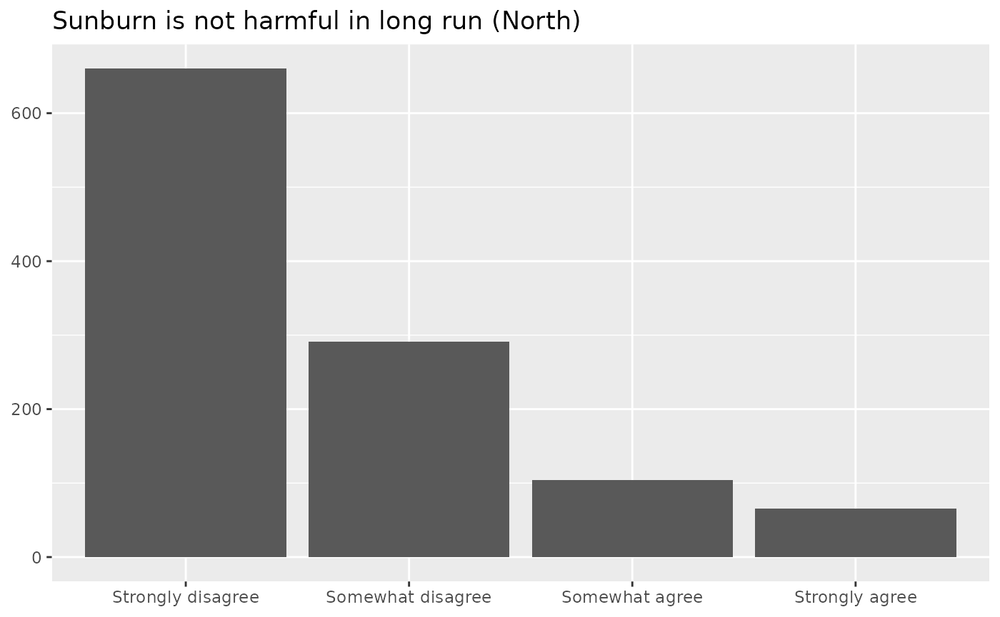

``` r

distribution_bar(temp4s$SUN_NOHARM,
                 title = 
                 "Sunburn is not harmful in long run (South)")
```

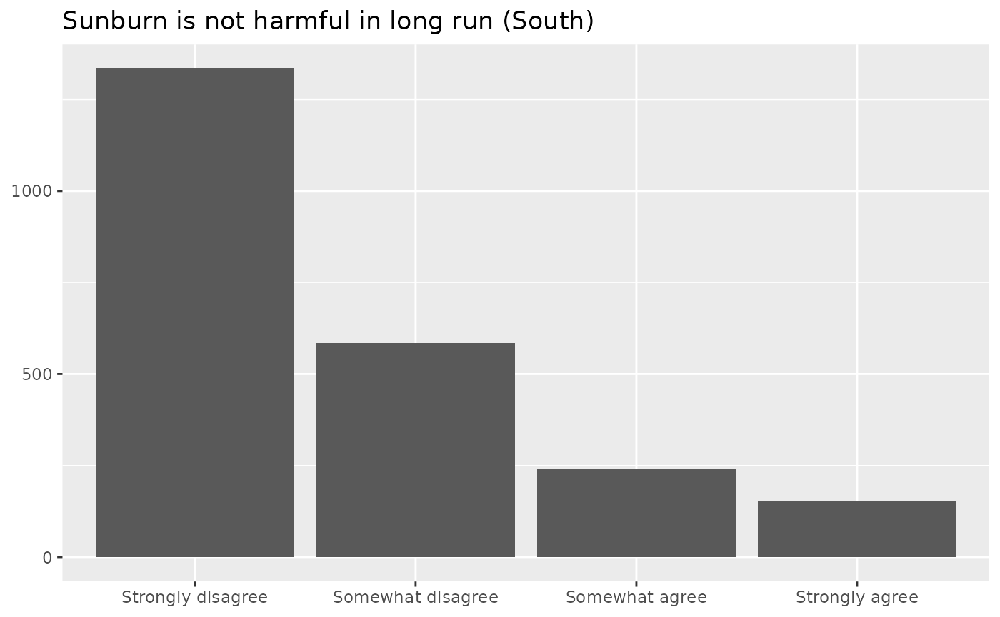 \###
Overall conclusion

Overall, among those living in metropolitan areas (cities) there are
only small differences between those living in the northeast and south
regions.

## Discussion

Was this repetitive and easy to make a mistake with a lot of copy and
pasting?

Definitely. Although it is a good introduction to how to think about
making comparisons and choosing subgroups.

Are there more efficient ways to do the actual calculations and make the
graphs?  
Yes.

Next week we will look at some more efficient approaches.

## Bonus example

``` r

pfemalenoharm <- distribution_bar(temp1f$SUN_NOHARM,
                 title = 
                 "Females") +
           theme(axis.text.x = element_text(angle = 90))
pmalenoharm <- distribution_bar(temp1m$SUN_NOHARM,
                 title = 
                 "Males)") +
          theme(axis.text.x = element_text(angle = 90))

pfemalecloudy <- distribution_bar(temp1f$SUN_CLOUDY,
                 title = 
                 "Cloudy  (females)") +
          theme(axis.text.x = element_text(angle = 90))
pmalecloudy <- distribution_bar(temp1m$SUN_CLOUDY,
                 title = 
                 "Cloudy  (males)") +
          theme(axis.text.x = element_text(angle = 90))

plots(pfemalenoharm, pmalenoharm,
      pfemalecloudy, pmalecloudy,
      n_columns = 2,
      title = "Responses to sunburn questions",
      subtitle = "People over 70")  
```

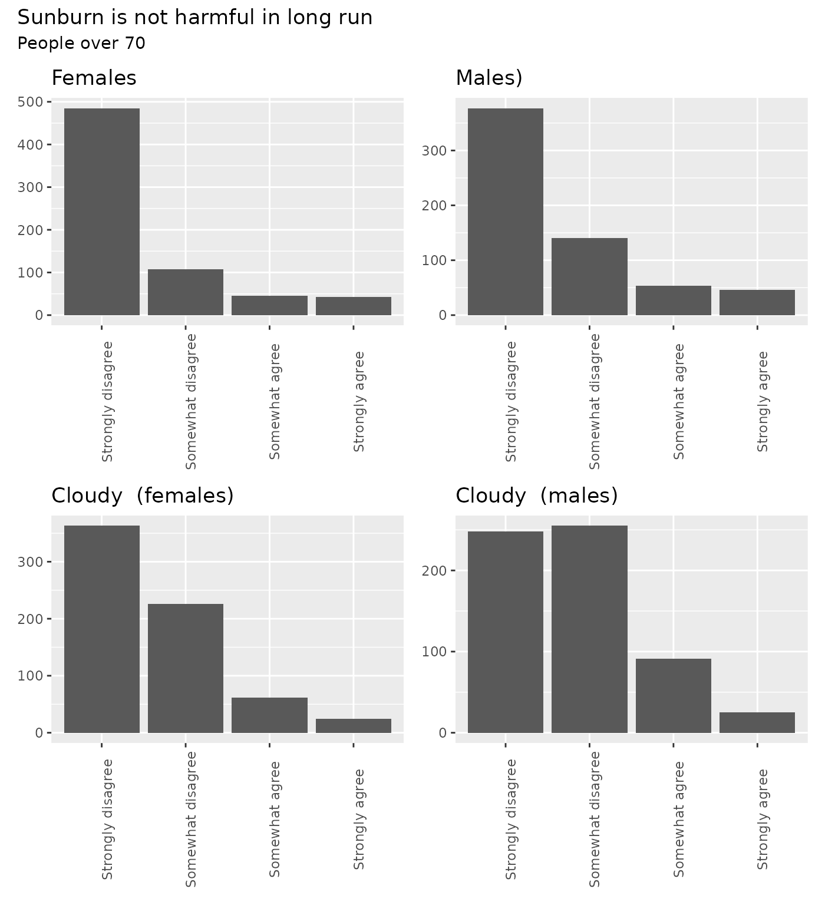

``` r

# Put the two data sets together
rbind(temp1m, temp1f) |>
     # group the data by gender
     data_group(P_GENDER) |>
     #calculate all of the statistics
     data_summary(
      Mean_Cloudy = distribution_mean(SUN_CLOUDY_N),
      Median_Cloudy = distribution_median(SUN_CLOUDY_N),
      Mean_No_Harm = distribution_mean(SUN_NOHARM_N),
      Median_No_Harm = distribution_median(SUN_NOHARM_N)
      ) |>
     display()
```

| P_GENDER | Mean_Cloudy | Median_Cloudy | Mean_No_Harm | Median_No_Harm |
|:---------|------------:|--------------:|-------------:|---------------:|
| Male     |        1.83 |             2 |         1.63 |              1 |
| Female   |        1.63 |             1 |         1.48 |              1 |
