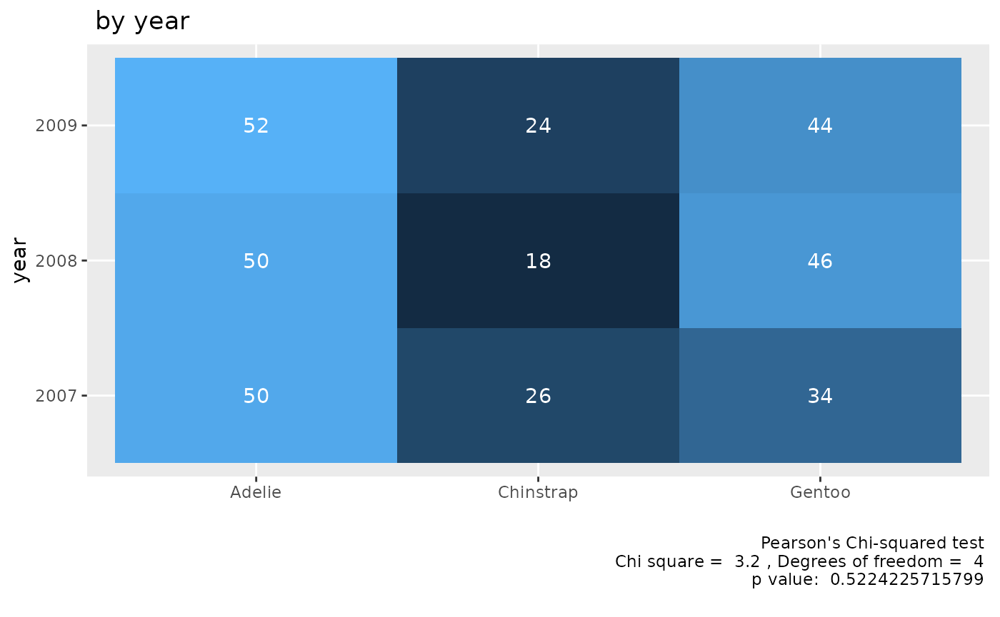
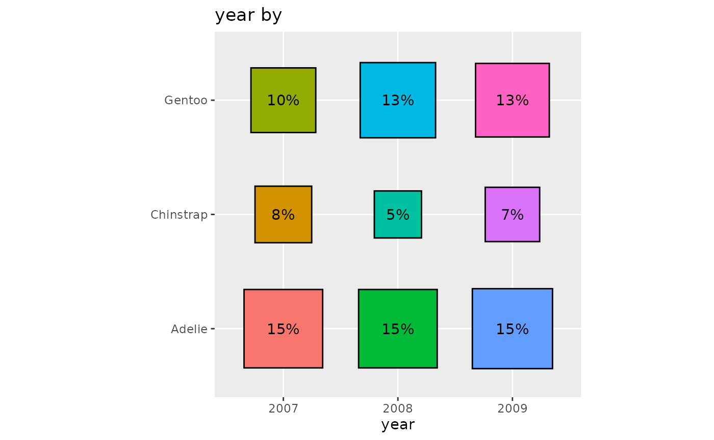

# Cross tabs part 1

``` r

library(icorp26)
library(ggplot2)
library(easystats)
#> # Attaching packages: easystats 0.7.6
#> ✔ bayestestR  0.18.1   ✔ correlation 0.8.8 
#> ✔ datawizard  1.3.1    ✔ effectsize  1.0.2 
#> ✔ insight     1.5.2    ✔ modelbased  0.16.0
#> ✔ performance 0.17.1   ✔ parameters  0.29.2
#> ✔ report      0.6.4    ✔ see         0.14.1
```

“Cross tabs” are a kind of data presentation where two variables are
displayed together by “crossing” them. That means that the results for
every combination of two variables are displayed.

For example, suppose there is a coffee shop which offers coffee with and
without milk and in three sizes.

There would be 6 ways of combining these two characteristics:

- Small & Milk  
- Small & No Milk  
- Medium & Milk  
- Medium & No Milk  
- Large & Milk  
- Large & No Milk

You can rearrange the list however you want, but there always will be 6
combinations, because $`2*3=6`$ The two comes from the milk/no milk
variable and the 3 from the three sizes.

Now suppose you have data on how many of each order type there were on
one day.

| Combination      | Number |
|------------------|--------|
| Small & Milk     | 10     |
| Small & No Milk  | 9      |
| Medium & Milk    | 8      |
| Medium & No Milk | 11     |
| Large & Milk     | 12     |
| Large & No Milk  | 15     |

Or you can rearrange the data to put the focus more on milk/no milk
rather than size.

| Combination      | Number |
|------------------|--------|
| Small & Milk     | 10     |
| Medium & Milk    | 8      |
| Large & Milk     | 12     |
| ——————–          | ———    |
| Small & No Milk  | 9      |
| Medium & No Milk | 11     |
| Large & No Milk  | 15     |

If you add them up, you get $`10+9 = 19`$ that are small, $`8+11 = 19`$
that are medium, and $`12+15 = 27`$ that are large.

Or you could say that you get $`10+8+12 = 30`$ that are with milk and
$`9+11+15=25`$ that are without milk.

You could also break this into two tables using one of the variables.
For example, we can make a separate set of tables that break up the
sample based on size.

| Combination     | Number |
|-----------------|--------|
| Small & Milk    | 10     |
| Small & No Milk | 9      |

| Combination      | Number |
|------------------|--------|
| Medium & Milk    | 8      |
| Medium & No Milk | 11     |

| Combination     | Number |
|-----------------|--------|
| Large & Milk    | 12     |
| Large & No Milk | 15     |

You could have a question like: are some sizes of coffee more likely to
be ordered with milk than others?

To answer this question you need to think about both variables at once.
A cross tab is one way to try to answer ths kind of question.
Rearranging these by “crossing” the variables, we get 3 rows and 2
columns (or 2 columns and 3 rows). By looking across the rows and down
the columns we can understant each variable. And by comparing rows to
other rows and columns to other columns

| Size   | Milk | No Milk |
|--------|------|---------|
| Small  | 10   | 9       |
| Medium | 8    | 11      |
| Large  | 12   | 15      |

By reorganizing in this way we can more easily see how each of the
variables are distribute *and* how they relate to each other. It is also
a more compact layout.

Now let’s look at some real data. We will use the penguins data set,
which comes from a multiyear study of penguins on three islands near the
South Pole.

``` r

data_tabulate(penguins$year, by = penguins$species, 
              remove_na = TRUE) -> table
   table |>  print_md()
```

| penguins\$year | Adelie | Chinstrap | Gentoo | Total |
|:---------------|-------:|----------:|-------:|------:|
| 2007           |     50 |        26 |     34 |   110 |
| 2008           |     50 |        18 |     46 |   114 |
| 2009           |     52 |        24 |     44 |   120 |
|                |        |           |        |       |
| Total          |    152 |        68 |    124 |   344 |

Notice that in this cross tab the full sample distributions are given in
the `Total` column for year and the `Total` row for Island.

We can see that the biggest combination was 52 Adelie penguins in 2009.
The smallest is 18 Chinstrap penguins in 2008.

We can show this graphically. In this kind of plot the intensity of the
color represents the size of the numbers.

``` r

table |> plot()
```



Another way to represent a cross tab is to convert the numbers to
percentages.

Looking at the coffee shop data we have 65 orders. If we take the number
for a combination, divide by 65 and then multiply the result by 100 we
get the percents (rounded which means that they add up to 99 instead of
100).

| Combination      | Number | Percentage |
|------------------|--------|------------|
| Small & Milk     | 10     | 15%        |
| Small & No Milk  | 9      | 14%        |
| Medium & Milk    | 8      | 12%        |
| Medium & No Milk | 11     | 17%        |
| Large & Milk     | 12     | 18%        |
| Large & No Milk  | 15     | 23%        |

Again, this could be split into rows and columns.

Graphically, we can display this view of the relationship with a display
where the size of the squares represents the size of the percentages.

``` r

data_tabulate(penguins$year, by = penguins$species,
              proportions = "full",
              remove_na = TRUE) |>
     print_md()
```

| penguins\$year | Adelie     | Chinstrap | Gentoo     | Total |
|:---------------|:-----------|:----------|:-----------|------:|
| 2007           | 50 (14.5%) | 26 (7.6%) | 34 (9.9%)  |   110 |
| 2008           | 50 (14.5%) | 18 (5.2%) | 46 (13.4%) |   114 |
| 2009           | 52 (15.1%) | 24 (7.0%) | 44 (12.8%) |   120 |
|                |            |           |            |       |
| Total          | 152        | 68        | 124        |   344 |

``` r

data_tabulate(penguins$year, by = penguins$species,
              proportions = "full",
              remove_na = TRUE) |> plot() 
```


