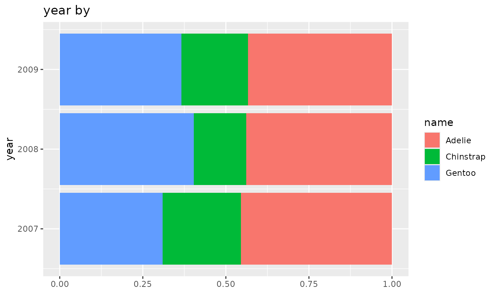
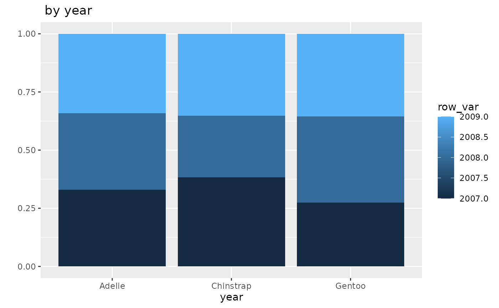

# Cross_tabs2

``` r

library(easystats)
library(ggplot2)
```

So far we’ve looked at how two variables are distributed across every
combination of values.

Howeve, we often are interested in how the two variables relate to each
other. For example, are people who get small coffees different than
people who get large coffees?

This can be tricky because there are different numbers of coffee orders
in each group.

One way to understand this would be to break our table into parts.

## Rows

| Size   | Milk | No Milk | Total |
|--------|------|---------|-------|
| Small  | 10   | 9       | 19    |
| Medium | 8    | 11      | 19    |
| Large  | 12   | 15      | 27    |

| Size  | Milk | No Milk |
|-------|------|---------|
| Small | 10   | 9       |

| Size   | Milk | No Milk | Total |
|--------|------|---------|-------|
| Medium | 8    | 11      | 19    |

| Size  | Milk | No Milk | Total |
|-------|------|---------|-------|
| Large | 12   | 15      | 27    |

Now we can calculate the percentages for each coffee size.

| Size  | Milk | No Milk |
|-------|------|---------|
| Small | 53%  | 47%     |

| Size   | Milk | No Milk | Total |
|--------|------|---------|-------|
| Medium | 42%  | 58%     | 19    |

| Size  | Milk | No Milk | Total |
|-------|------|---------|-------|
| Large | 44%  | 56%     | 27    |

It turns out the medium coffee group has the highest percentage of
orders with no milk. This is true even though the large group had more
actual no milk orders.

Percentages are important because they let us make comparisons on a
*standardized* basis. That is we convert all of the rows to a
representation that is based on having 100 observations in the group.

“Percent” comes from “Per cent” where cent means 100. Even though there
are not 100 people in the group, we can still calculate how many would
be in each milk/no milk category if the balance didn’t change.

Because we calculated within the rows, we call these *row percents*.

We can put the table back together.

| Size   | Milk | No Milk |
|--------|------|---------|
| Small  | 53%  | 47%     |
| ———–   | ——-  | ——-     |
| Medium | 42%  | 58%     |
| ———–   | ——-  | ——-     |
| Large  | 44%  | 56%     |

We can tell that this table is row percents because adding up the values
in each row give you 100.

Using the penguins data we can get row percents.

``` r

data_tabulate(penguins$year, by = penguins$species,
              proportions = "row",
              remove_na = TRUE) -> table
table |> print_md()
```

| penguins\$year | Adelie     | Chinstrap  | Gentoo     | Total |
|:---------------|:-----------|:-----------|:-----------|------:|
| 2007           | 50 (45.5%) | 26 (23.6%) | 34 (30.9%) |   110 |
| 2008           | 50 (43.9%) | 18 (15.8%) | 46 (40.4%) |   114 |
| 2009           | 52 (43.3%) | 24 (20.0%) | 44 (36.7%) |   120 |
|                |            |            |            |       |
| Total          | 152        | 68         | 124        |   344 |

``` r

table |> plot() 
```



The percentage of penguins who are Adelie was pretty stable over the
three years. However, among those measured in 2008 the percentage of
penguins who are Chinstrap dropped substantially compared to those from
2007. This recovered slightly among the observations in 2009. This means
that the percent who are Gentoo increased, since the percentagess have
to add up to 100 within each row.

## Columns

We can do the same kind of process with columns.

| Size   | Milk | No Milk | Total |
|--------|------|---------|-------|
| Small  | 10   | 9       | 19    |
| Medium | 8    | 11      | 19    |
| Large  | 12   | 15      | 27    |
| Total  | 30   | 35      | 65    |

| Size   | Milk |
|--------|------|
| Small  | 10   |
| Medium | 8    |
| Large  | 12   |
|        |      |
| Total  | 30   |

| Size   | No Milk |
|--------|---------|
| Small  | 9       |
| Medium | 11      |
| Large  | 15      |
|        |         |
| Total  | 35      |

Next, we calculate the percentages base on the column totals.

| Size   | Milk |
|--------|------|
| Small  | 33%  |
| Medium | 27%  |
| Large  | 40%  |
|        |      |
| Total  | 30   |

| Size   | No Milk |
|--------|---------|
| Small  | 26%     |
| Medium | 31%     |
| Large  | 43%     |
|        |         |
| Total  | 35      |

These are the *column percents*.

Putting the table back together we can easily see how they compare.

| Size   | Milk | No Milk |
|--------|------|---------|
| Small  | 33%  | 26%     |
| Medium | 27%  | 31%     |
| Large  | 40%  | 43%     |
|        |      |         |
| Total  | 30   | 35      |

Looking at it from this perspective, we can see that people who ordered
coffee without milk, generally speaking, ordered larger coffees than
those who ordered with milk.

Now looking at the penguin data column percent, we can look at how year
is distributed for each species.

``` r

data_tabulate(penguins$year, by = penguins$species,
              proportions = "column",
              remove_na = TRUE) -> table
table |> print_md()
```

| penguins\$year | Adelie     | Chinstrap  | Gentoo     | Total |
|:---------------|:-----------|:-----------|:-----------|------:|
| 2007           | 50 (32.9%) | 26 (38.2%) | 34 (27.4%) |   110 |
| 2008           | 50 (32.9%) | 18 (26.5%) | 46 (37.1%) |   114 |
| 2009           | 52 (34.2%) | 24 (35.3%) | 44 (35.5%) |   120 |
|                |            |            |            |       |
| Total          | 152        | 68         | 124        |   344 |

``` r

table |> plot() 
```



The Adelie were evenly divided over the three years. Among the
Chinstraps, a smaller percentage of observations were from 2008 than
other species. Among Gentoo, 2007 was the smallest year.

## Choosing a type of percentage

With a two variable table, we have see 4 possible ways to present the
data:

- The plain numbers
- The total percents
- The row percents
- the column percents

Which one you should report depends on what question you to answer or,
more generally, what your purpose is.

If you want to make comparisons, you most likely want to use the
percents *within* the groups you want to compare.

If you want to know if the distribution of species changed from year to
you, use the percentage calculated within the years; in the tables here
that would be the row percentages.

If you want to know if the three species had different distributions of
years, you would want the column percents.

If you want to know if any of the combinations of year and species is
over or underrepresented in the sample, you want the total percents.

But, if you want to know how many of something there are, you need to
use the actual numbers. Thinking about our coffee shop example. In the
end, we probably want to be able to predict how many of each kind of
order we will get next week. That will let us be sure to have enough
coffee, milk and cups. In that case you need numbers and not percents.
