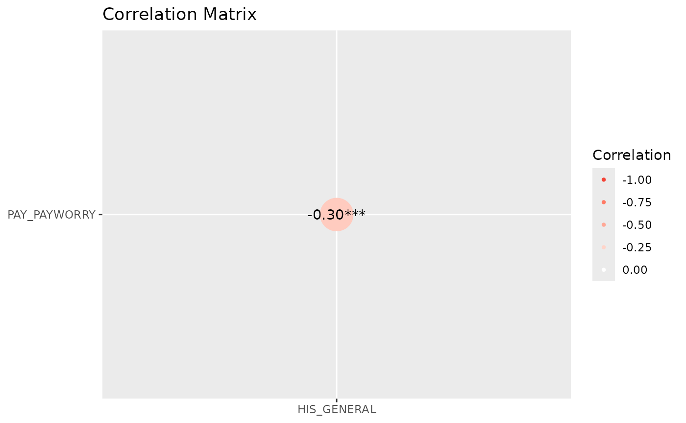

# More graphs

``` r
library(icorp26)
library(easystats)
# Attaching packages: easystats 0.7.6
✔ bayestestR  0.18.1   ✔ correlation 0.8.8 
✔ datawizard  1.3.1    ✔ effectsize  1.0.2 
✔ insight     1.5.2    ✔ modelbased  0.16.0
✔ performance 0.17.1   ✔ parameters  0.29.2
✔ report      0.6.4    ✔ see         0.14.1
library(ggplot2)
```

``` r


correlation::correlation(rss1,
            select =
              c("PAY_PAYWORRY",
             "HIS_GENERAL"),
           method = "polychoric", 
           include_factors = TRUE
            ) ->
     results
     plot(summary(results), 
          show_data = "points")
```


