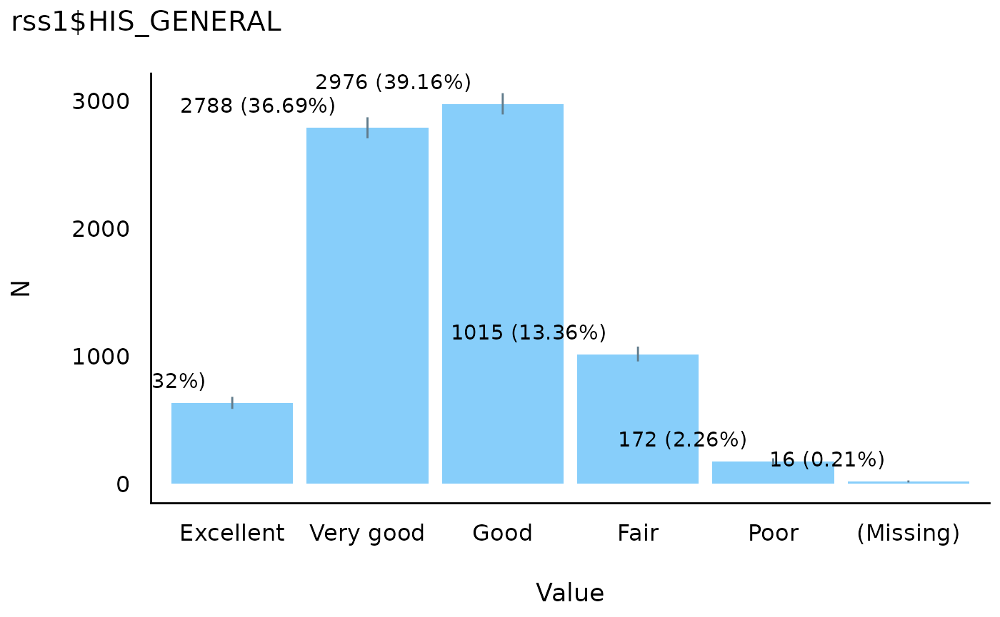
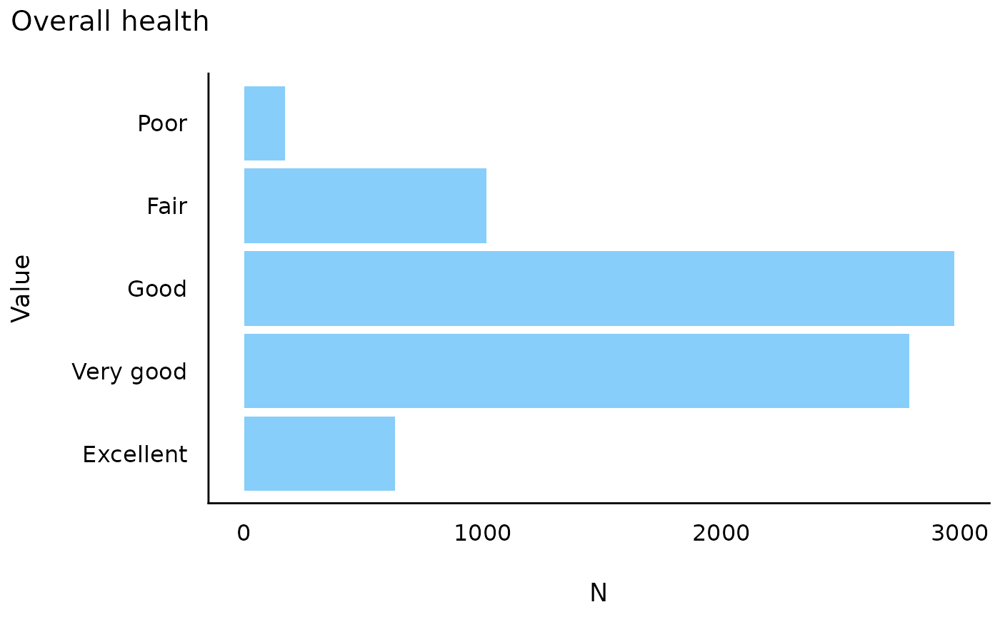
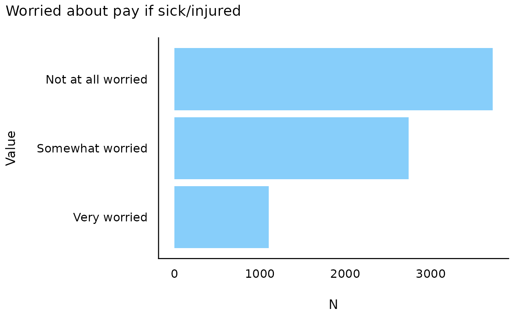
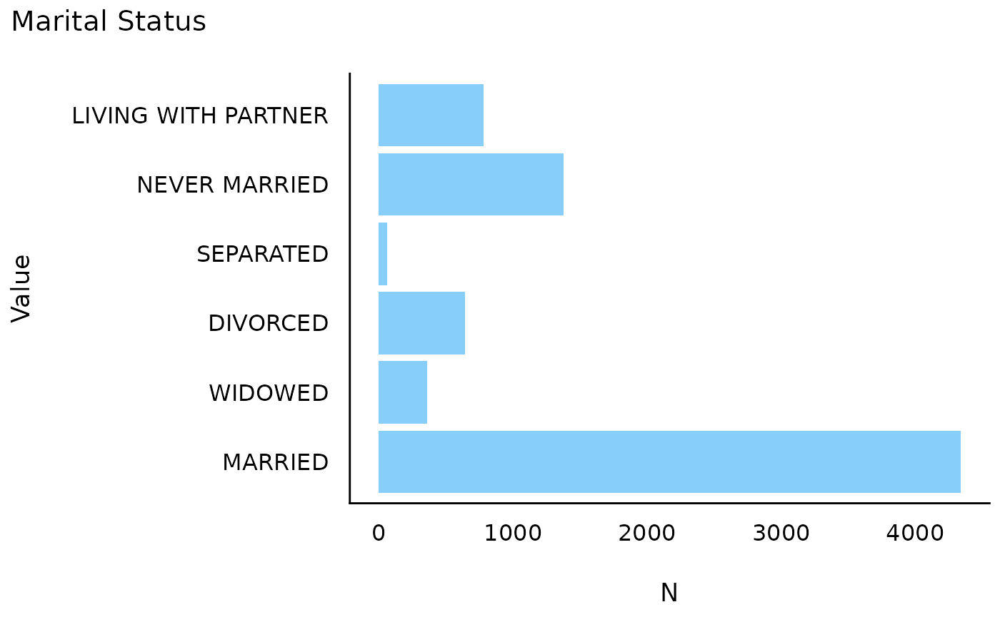

# Basic plots

``` r

library(icorp26)
library(easystats)
#> # Attaching packages: easystats 0.7.6
#> ✔ bayestestR  0.18.1   ✔ correlation 0.8.8 
#> ✔ datawizard  1.3.1    ✔ effectsize  1.0.2 
#> ✔ insight     1.5.1    ✔ modelbased  0.15.0
#> ✔ performance 0.17.0   ✔ parameters  0.29.1
#> ✔ report      0.6.4    ✔ see         0.14.0
```

We can also make some simple bar charts to display these. (There are
many types of plots but these are to get started.)

``` r

data_tabulate(rss1$HIS_GENERAL) |> plot() 
```



That’s a mess!

Fortunately, we can use some options from the `ggplot2` package and some
extra options.

``` r

library(ggplot2)
```

``` r

data_tabulate(rss1$HIS_GENERAL) |> 
     plot(label_values = FALSE, error_bar = FALSE,
          show_na = "never") + 
     coord_flip() +
     labs(title = "Overall health")
```



``` r


data_tabulate(rss1$PAY_PAYWORRY) |>
     plot(label_values = FALSE, error_bar = FALSE,
          show_na = "never") + 
     coord_flip() +
     labs(title = "Worried about pay if sick/injured") 
```



``` r


data_tabulate(rss1$MARSTAT) |> 
     plot(label_values = FALSE, error_bar = FALSE,
          show_na = "never") + 
     coord_flip() +
     labs(title = "Marital Status")
```



They definitely are more complex, but you also have a huge amount of
flexibility. You can change colors,shapes, sizes and more.
