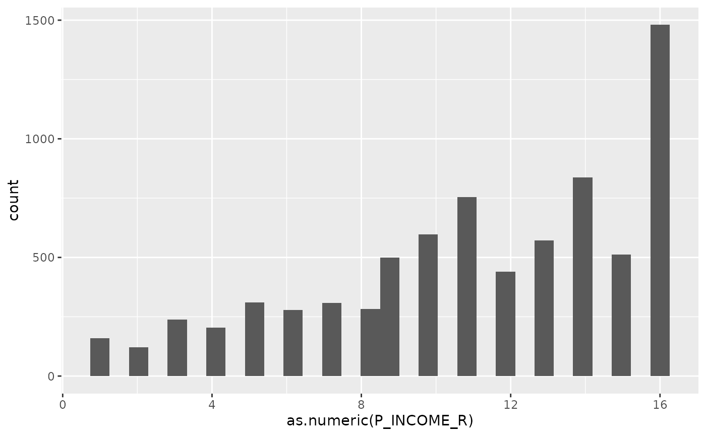
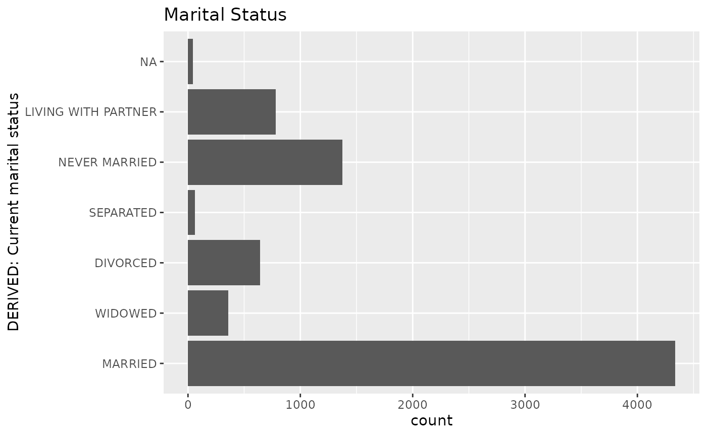

# Basic plots

``` r

library(icorp26)
library(easystats)
```

We can also make some simple bar charts to display these. (There are
many types of plots but these are to get started.)

``` r

data_tabulate(rss1$HIS_GENERAL) |> plot() 
```


That’s a mess!

Fortunately, we can use some options from the `ggplot2` package and some
extra options.

``` r

library(ggplot2)
```

``` r

data_tabulate(rss1$HIS_GENERAL) |> 
     plot(label_values = FALSE, error_bar = FALSE,
          show_na = "never") + 
     coord_flip() +
     labs(title = "Overall health")
```


``` r


data_tabulate(rss1$PAY_PAYWORRY) |>
     plot(label_values = FALSE, error_bar = FALSE,
          show_na = "never") + 
     coord_flip() +
     labs(title = "Worried about pay if sick/injured") 
```


``` r


data_tabulate(rss1$MARSTAT) |> 
     plot(label_values = FALSE, error_bar = FALSE,
          show_na = "never") + 
     coord_flip() +
     labs(title = "Marital Status")
```


A histogram is one way to present a distribution of a numeric variable
is using a histogram. For this example I will use full ggplot code.

``` r

ggplot(rss1, aes(as.numeric(P_INCOME_R))) +
     geom_histogram()
#> `stat_bin()` using `bins = 30`. Pick better value `binwidth`.
```



Here is an example of the bar plot using ggplot.

``` r

ggplot(rss1, aes(MARSTAT)) +
     geom_bar() +
     coord_flip() +
     labs(title = "Marital Status")
```



They definitely are more complex, but you also have a huge amount of
flexibility. You can change colors,shapes, sizes and more.
