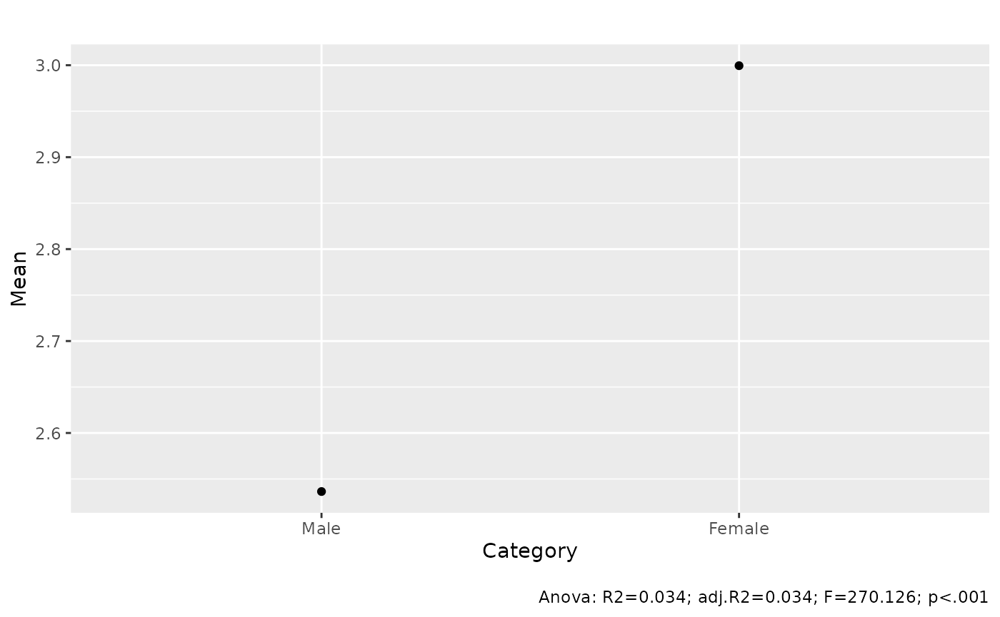
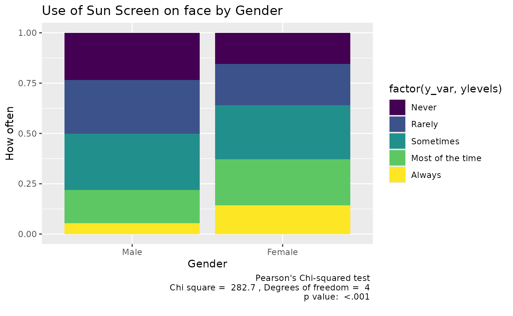
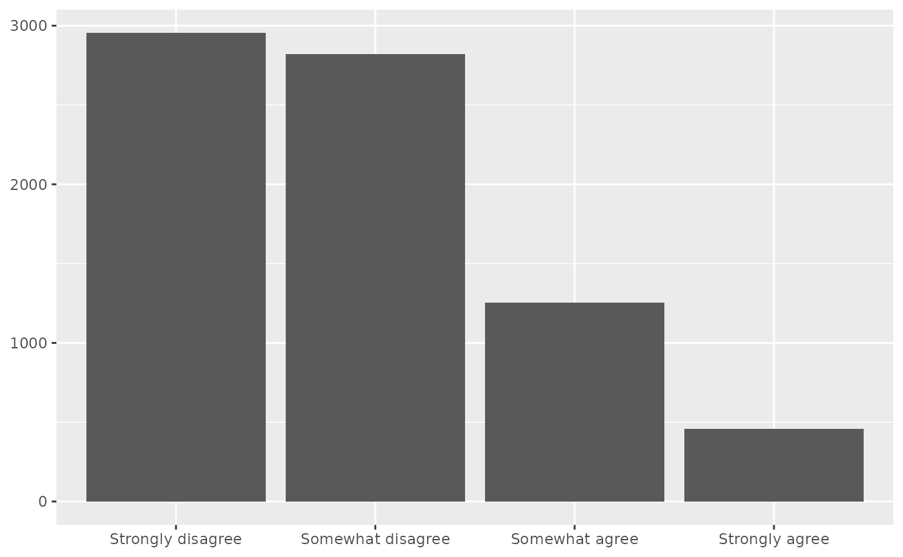
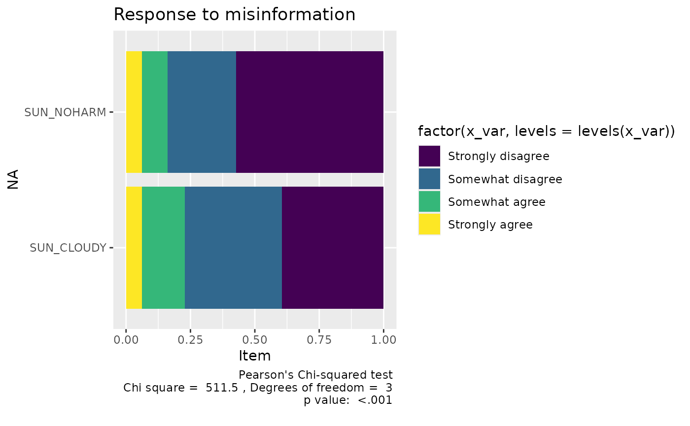

# Cookbook

This document shows how to do a number of tasks you may want to do in
your poster.

Remember that have *data frames* and then *variables* within the data
frame. We generally refer to one variable in a dataframe as
`data_frame_name$variable_name`. Both must be spelled exactly correctly
and with the right upper and lower case letters.

You also need to make sure that you are using numeric variables when you
need numbers.

Get means for groups with an F test.

``` r

means_by_group(to_numeric(rss1$SUN_USEFACE), 
               by =rss1$P_GENDER)
```

    ## # Mean of When outdoors, how often use sunscreen on face by Panel Profile: Respondent gender
    ## 
    ## Category | Mean |    N |   SD
    ## -----------------------------
    ## Male     | 2.54 | 3675 | 1.17
    ## Female   | 3.00 | 3888 | 1.27
    ## Total    | 2.77 | 7563 | 1.25
    ## 
    ## Anova: R2=0.034; adj.R2=0.034; F=270.126; p<.001

Plot the means by group with an F test

``` r

means_by_group(to_numeric(rss1$SUN_USEFACE), 
               by =rss1$P_GENDER) |> plot()
```

    ## Warning: Removed 2 rows containing missing values or values outside the scale range
    ## (`geom_segment()`).



Make a frequency table

``` r

data_tabulate(rss1$SUN_CLOUDY, metrics = c("N", "valid"), 
              remove_na = TRUE)
```

    ## Agree-disagree: cloudy days don't need to worry about sun (rss1$SUN_CLOUDY) <categorical>
    ## # total N=7489 valid N=7489
    ## 
    ## Value             |    N | Raw % | Valid % | Cumulative %
    ## ------------------+------+-------+---------+-------------
    ## Strongly disagree | 2955 | 39.46 |   39.46 |        39.46
    ## Somewhat disagree | 2823 | 37.70 |   37.70 |        77.15
    ## Somewhat agree    | 1254 | 16.74 |   16.74 |        93.90
    ## Strongly agree    |  457 |  6.10 |    6.10 |       100.00

Make a cross tabulation

``` r

data_tabulate(rss1$SUN_USEFACE,rss1$P_GENDER , 
              remove_na = TRUE, proportions = "column") |>
     print_md()
```

| rss1\$SUN_USEFACE |         Male |       Female | Total |
|:------------------|-------------:|-------------:|------:|
| Never             |  865 (23.5%) |  602 (15.5%) |  1467 |
| Rarely            |  976 (26.6%) |  794 (20.4%) |  1770 |
| Sometimes         | 1028 (28.0%) | 1049 (27.0%) |  2077 |
| Most of the time  |  610 (16.6%) |  890 (22.9%) |  1500 |
| Always            |   196 (5.3%) |  553 (14.2%) |   749 |
|                   |              |              |       |
| Total             |         3675 |         3888 |  7563 |

Visualize a cross tab

``` r

data_tabulate(rss1$SUN_USEFACE,rss1$P_GENDER , 
              remove_na = TRUE, proportions = "column") |> plot() +
     labs(title = "Use of Sun Screen on face by Gender",
          x = "Gender", y = "How often")
```



Get the chi square for a cross tab.

``` r

data_tabulate(rss1$SUN_USEFACE,rss1$P_GENDER , 
              remove_na = TRUE, proportions = "column") |> 
     data_chisq()
```

    ## 
    ##  Pearson's Chi-squared test
    ## 
    ## data:  X[[i]]
    ## X-squared = 282.73, df = 4, p-value < 2.2e-16

Basic bar chart of one variable.

``` r

distribution_bar(rss1$SUN_CLOUDY)
```



Compare a lot of categorical/nominal variables that all have the same
responses in a compact way. There are alot ofpossivllwe ways to do this.

``` r

library(dplyr)
```

    ## 
    ## Attaching package: 'dplyr'

    ## The following object is masked from 'package:datawizard':
    ## 
    ##     recode_values

    ## The following objects are masked from 'package:stats':
    ## 
    ##     filter, lag

    ## The following objects are masked from 'package:base':
    ## 
    ##     intersect, setdiff, setequal, union

``` r

library(tidyr)
rss1 |> select("SUN_NOHARM", "SUN_CLOUDY") |>
     pivot_longer(cols = c("SUN_NOHARM", "SUN_CLOUDY"), 
                  names_to = "variable",  
                  values_to = "response") |>
     data_tabulate( "variable", by = "response", 
                    proportions = "row", remove_na = TRUE) |>
     plot() -> p
  p + 
 labs(title = "Response to misinformation",
                   y ="Item"
                   )
```



How to summarize the variables in your dataset.

The easiest way is to use the table1 package.

``` r

library(gtsummary)
mtcars |> tbl_summary()
```

[TABLE]

Or if you just want to include some of the variables

``` r

mtcars |> data_codebook(include = c(disp, hp, drat)) |>
     display()
```

| ID  | Name | Type    | Missings |         Values |          N |
|:----|:-----|:--------|---------:|---------------:|-----------:|
| 1   | mpg  | numeric | 0 (0.0%) | \[10.4, 33.9\] |         32 |
|     |      |         |          |                |            |
| 2   | cyl  | numeric | 0 (0.0%) |              4 | 11 (34.4%) |
|     |      |         |          |              6 |  7 (21.9%) |
|     |      |         |          |              8 | 14 (43.8%) |
|     |      |         |          |                |            |
| 3   | disp | numeric | 0 (0.0%) |  \[71.1, 472\] |         32 |
|     |      |         |          |                |            |
| 4   | hp   | numeric | 0 (0.0%) |    \[52, 335\] |         32 |
|     |      |         |          |                |            |
| 5   | drat | numeric | 0 (0.0%) | \[2.76, 4.93\] |         32 |
|     |      |         |          |                |            |
| 6   | wt   | numeric | 0 (0.0%) | \[1.51, 5.42\] |         32 |
|     |      |         |          |                |            |
| 7   | qsec | numeric | 0 (0.0%) | \[14.5, 22.9\] |         32 |
|     |      |         |          |                |            |
| 8   | vs   | numeric | 0 (0.0%) |              0 | 18 (56.2%) |
|     |      |         |          |              1 | 14 (43.8%) |
|     |      |         |          |                |            |
| 9   | am   | numeric | 0 (0.0%) |              0 | 19 (59.4%) |
|     |      |         |          |              1 | 13 (40.6%) |
|     |      |         |          |                |            |
| 10  | gear | numeric | 0 (0.0%) |              3 | 15 (46.9%) |
|     |      |         |          |              4 | 12 (37.5%) |
|     |      |         |          |              5 |  5 (15.6%) |
|     |      |         |          |                |            |
| 11  | carb | numeric | 0 (0.0%) |       \[1, 8\] |         32 |
|     |      |         |          |                |            |

mtcars (32 rows and 11 variables, 11 shown) {.table}

``` r

table1::table1(~., data = mtcars, 
               caption = "MT cars Variables") |> 
     t1flex() 
```

[TABLE]

MT cars Variables {.table .cl-37e1d8ea quarto-disable-processing="true"}
